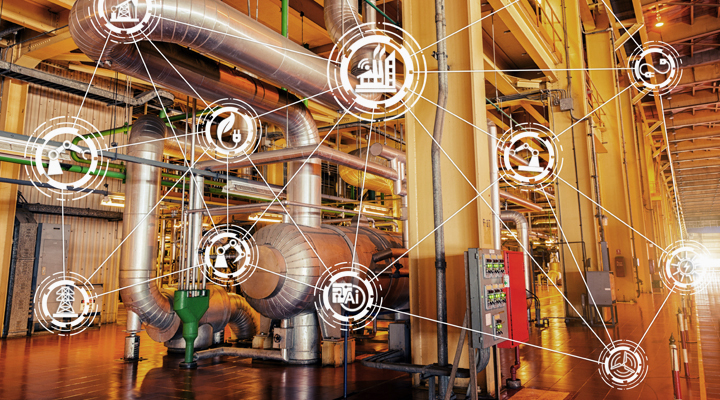

# Proyecto Final Grupo ..
##   Proyectos: ##  
    
    1. Sistema CIP(Clean In Place, Limpieza en el lugar)

    2. Sistema de control para línea de producción. 

Nota: cada proyecto tiene su propia carpeta con el nombre respectivo a cada uno.

## Integrantes ##  
1. [Andrés Montaño](https://github.com/maj3210) 
2. [Federico Birge](https://github.com/FedeBirge)
3. [Leonardo Gonzalez](https://github.com/leolgonzalez)
4. [Mario Gonzalez](https://github.com/mariogonzalezispc)
5. [Pedro Rojo](https://github.com/tecnosisnet)

## Objetivos del Proyecto ##

1. Sistemas Ciberfísicos: 
 - Comprender y aplicar conceptos fundamentales de sistemas ciberfísicos, como la interacción  entre componentes computacionales y físicos. 
 - Diseñar soluciones integradas que respondan adecuadamente a las entradas del mundo real y operen de manera confiable en entornos dinámicos.

2. Automatización de Eventos Discretos: 
 - Desarrollar habilidades para modelar, analizar y diseñar sistemas de automatización de eventos discretos. 
 - Implementar soluciones de automatización que cumplan con especificaciones dadas, considerando la eficiencia, seguridad y fiabilidad. 